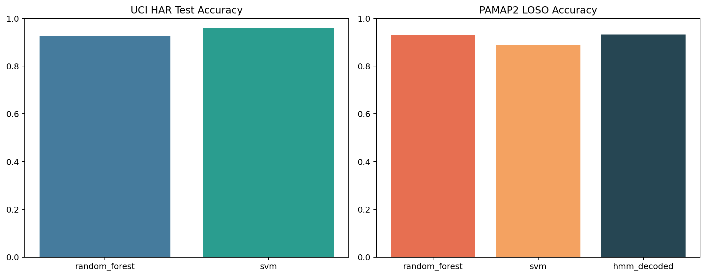

# IMU-Based Human Activity Recognition for Occupational Health

This repository presents a student research project on human activity recognition from wearable IMU data with an occupational-health framing. The main goal is to compare simple baseline models across two benchmark datasets while keeping the pipeline reproducible and easy to inspect.

The project combines two evaluation settings:
- supervised classification on the official UCI HAR train/test split
- leave-one-subject-out evaluation on windowed PAMAP2 protocol recordings



## Research question

How well do standard machine-learning baselines transfer across a curated benchmark split and a subject-level raw-signal evaluation when the target activities are relevant to routine movement and workplace posture?

## Datasets

### UCI HAR

- smartphone inertial windows
- official subject-disjoint train/test split
- activities: walking, walking upstairs, walking downstairs, sitting, standing, laying

### PAMAP2

- raw protocol recordings from wearable IMUs
- windows are generated from the continuous streams
- for this project, PAMAP2 is reduced to a narrower label set:
  - `sitting`
  - `standing`
  - `walking`
- evaluation uses leave-one-subject-out validation

## Method

The pipeline includes:
- Random Forest and Linear SVM baselines for both datasets
- handcrafted statistical and FFT-based features for PAMAP2 windows
- an optional PyTorch LSTM path for UCI HAR inertial signals
- saved predictions, visual summaries, metrics, and model artifacts

The default workflow is the classical ML baseline path. The LSTM branch is optional and only runs when `--train-lstm` is supplied.

## Current results

| Dataset | Model | Evaluation | Accuracy | Macro F1 |
| --- | --- | --- | ---: | ---: |
| UCI HAR | Linear SVM | Official subject-disjoint test split | 0.960 | 0.960 |
| UCI HAR | Random Forest | Official subject-disjoint test split | 0.926 | 0.924 |
| PAMAP2 | Random Forest | Leave-one-subject-out on raw-window features | 0.930 | 0.928 |
| PAMAP2 | Linear SVM | Leave-one-subject-out on raw-window features | 0.889 | 0.882 |

## Reproducing the pipeline

```bash
python -m pip install -r requirements.txt
python -m pip install -e .
python -m imu_har.cli --output-dir reports/results --model-dir models/results
```

Optional LSTM training:

```bash
python -m imu_har.cli --train-lstm
```

## Repository outputs

- `reports/results/metrics.json`
- `reports/results/uci_har_predictions.csv`
- `reports/results/pamap2_predictions.csv`
- `reports/results/performance_overview.png`
- `models/results/uci_har_best_model.joblib`
- `models/results/pamap2_best_model.joblib`
- `notebooks/real_data_walkthrough.ipynb`

## Limitations

- The checked-in outputs come from local runs on downloaded benchmark files.
- PAMAP2 is intentionally simplified here and does not represent the full activity space in the original dataset.
- The project is a baseline study, not a production-ready wearable analytics system.
- Raw datasets are expected under `data/raw/` and are intentionally excluded from version control.
