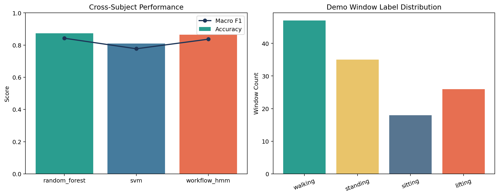

# IMU-Based Human Activity Recognition for Occupational Health

End-to-end wearable-sensor pipeline for classifying occupationally relevant activities such as walking, sitting, standing, and lifting. The repository is structured like a real applied ML project: windowed signal preprocessing, handcrafted time-series features, cross-subject evaluation, sequence smoothing, and reproducible demo outputs.



## Project Snapshot

- Focus: occupational activity recognition from IMU and accelerometer streams
- Activities: `walking`, `sitting`, `standing`, `lifting`
- Baselines: Random Forest, SVM, optional PyTorch LSTM
- Sequence layer: discrete HMM-style workflow smoothing across continuous streams
- Current demo result: `87.3%` cross-subject accuracy with Random Forest on the demo pipeline

## Why It Matters

Human activity recognition is often reported on curated benchmark windows, but occupational health use cases care about continuous, noisy movement data and cross-user generalisation. This repo is built around that framing:

- subject-wise evaluation instead of random window splits
- workflow-aware decoding instead of only independent predictions
- outputs that are useful for downstream reporting and safety analysis

## What This Repo Includes

- Sliding-window segmentation of continuous IMU streams
- Statistical and FFT-derived feature engineering
- Cross-subject evaluation with Random Forest and SVM baselines
- Optional PyTorch LSTM sequence classifier
- HMM-style workflow smoothing over continuous task sequences
- CLI entry point that writes metrics, model artifacts, and demo predictions

## Quick Start

```bash
python -m pip install -r requirements.txt
python -m pip install -e .
python -m imu_har.cli --output-dir reports/demo
```

Run without the neural baseline:

```bash
python -m imu_har.cli --skip-lstm
```

## Demo Results

| Model | Evaluation setup | Accuracy | Macro F1 |
| --- | --- | ---: | ---: |
| Random Forest | Leave-one-subject-out | 0.873 | 0.843 |
| SVM | Leave-one-subject-out | 0.810 | 0.777 |
| HMM-decoded workflow output | Sequence-smoothed predictions | 0.865 | 0.836 |

The optional LSTM path is included as a neural baseline, but the current short demo configuration is intentionally lightweight and underperforms the classical models. That tradeoff is visible rather than hidden, which makes the repo more honest and easier to extend.

## Example Outputs

- `reports/demo/metrics.json` with fold-wise model metrics and classification reports
- `reports/demo/window_predictions.csv` with per-window predictions for each model
- `reports/demo/performance_overview.png` summarising model performance and class balance
- `reports/demo/random_forest_model.joblib` for the best-performing classical baseline

## Project Structure

- `src/imu_har/` package code for feature extraction, modeling, and CLI entry points
- `tests/` smoke test for the demo pipeline
- `reports/` generated metrics and prediction exports
- `data/` place raw UCI HAR, PAMAP2, or custom wearable data here
- `models/` reserved for longer-lived trained artifacts

## Adapting To Real Data

The current demo generates structured synthetic IMU streams with subject-specific variation so the full training and evaluation loop can be exercised. To plug in real datasets:

1. Replace the synthetic generator with your dataset loader.
2. Preserve the expected columns: subject identifier, workflow identifier, timestamp, activity label, and six IMU channels.
3. Reuse `segment_windows`, `extract_window_features`, and the evaluation utilities in `src/imu_har/pipeline.py`.
4. Increase sequence length or tune the LSTM path if you want a stronger neural baseline.

## Repo Strengths

- Runnable immediately without hunting for datasets
- Keeps modeling and evaluation code separate and reusable
- Uses cross-subject validation, which is closer to real deployment conditions
- Produces artifacts that are easy to show in a portfolio or discuss in interviews
